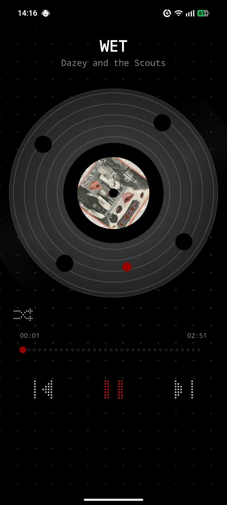
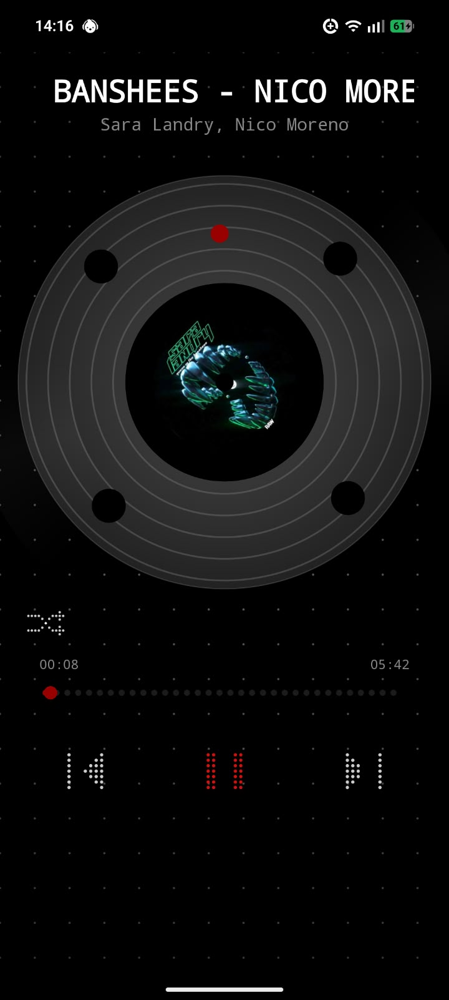
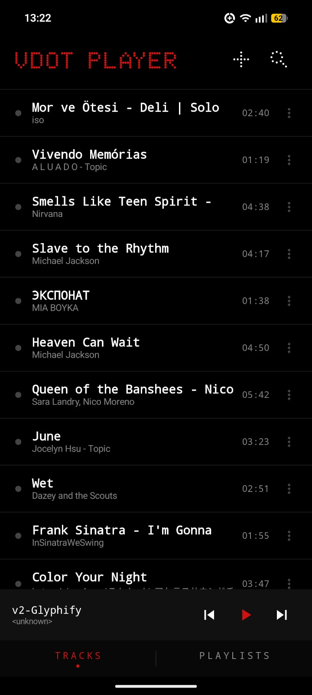
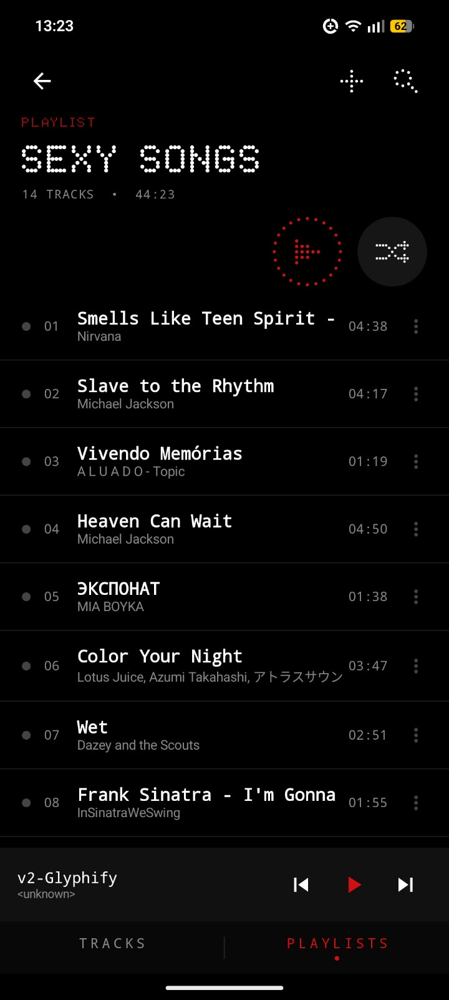

# Vdot Player

**A little music player with a big dot-matrix soul.** Vdot Player brings a bold, Nothing OS–inspired visual language to your on-device music: crisp monochrome surfaces, striking red accents, dotted typography, and a record-inspired full-screen player. It is a fun visual experiment built around the joy of listening—and a demo that is still actively in development.

> **Status: Demo / work in progress.** Features, visuals, and behavior may change. This project is not an official Nothing product and is not affiliated with or endorsed by Nothing Technology Limited.

## Preview

### See it in motion

[▶ Watch the Vdot Player demo video](docs/media/vdot-player-demo.mp4)

### Screenshots

| Now playing | Now playing |
|:--:|:--:|
|  |  |

| Track library | Playlist detail |
|:--:|:--:|
|  |  |

## What it does

- Browse and search audio stored on your Android device
- Play, pause, skip, shuffle, and seek through tracks
- Create and manage playlists
- Keep playback going in the background with media controls and notifications
- Enjoy a custom, record-inspired player screen and a Nothing OS–inspired dot-matrix look

## Built with

- **Kotlin** for Android development
- **Jetpack Compose** and **Material 3** for the interface
- **AndroidX Media3** (ExoPlayer and MediaSession) for playback and media controls
- **Coil** for image loading
- **Gradle** for builds

## Getting started

### Requirements

- Android Studio
- JDK 17
- Android SDK 34
- Android 8.0 (API 26) or later device or emulator

### Run the app

1. Clone this repository and open it in Android Studio.
2. Let Gradle sync, then select an Android device or emulator.
3. Run the `app` configuration and grant access to audio when prompted.

Build a debug APK from the project directory:

```bash
./gradlew assembleDebug
```

On Windows:

```bat
gradlew.bat assembleDebug
```

## Font and attribution

The app bundles **NDOT 47 (inspired by NOTHING)** by Interactivate under the SIL Open Font License 1.1. The font license is included in [`licenses/NDOT-47-OFL.txt`](licenses/NDOT-47-OFL.txt) and in the app assets.

Nothing and Nothing OS are trademarks of Nothing Technology Limited. Vdot Player is an independent, unofficial demo project; the visual inspiration does not imply sponsorship or endorsement.
